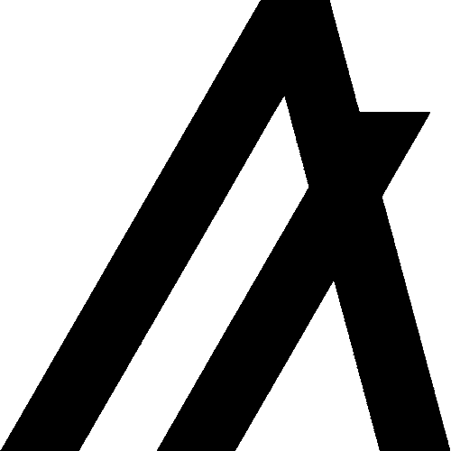

# Web3-dApps

# Introduction

- Web3 is a new era of the internet that is currently emerging thanks to the
power of blockchain technology which will help to solve many of the problems
that arose during Web1 and Web2. It is known for its decentralized platforms. user owned data, digital money, and interoperablity.
- Its simply a decentralized and user-owned internet. Web3 gives users full
ownership over their content, data, and assets via blockchains.
# Objective
 In this project we will build end-to-end Web3 dapps on the Algorand Blockchain that will help 10 Academy generate and distribute Non-Fungible Tokens (NFTs) as certificates that will represent the successful completion of a weekly challenge to trainees, and allow trainees with NFTs to interact with a smart contract to perform pre-defined actions. 

# Installation
    git clone git@github.com:nardoshood/Web3-dApps.git
    yarn install 
    yarn start
 # Contributor
 